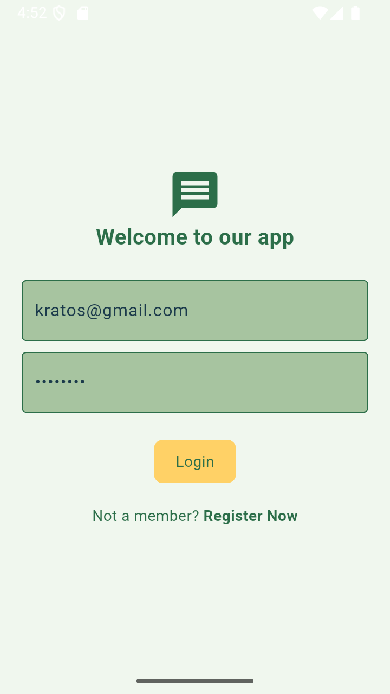
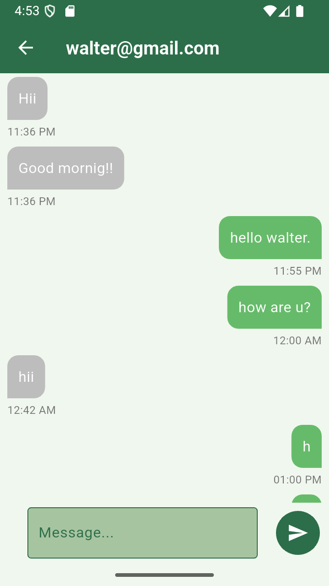
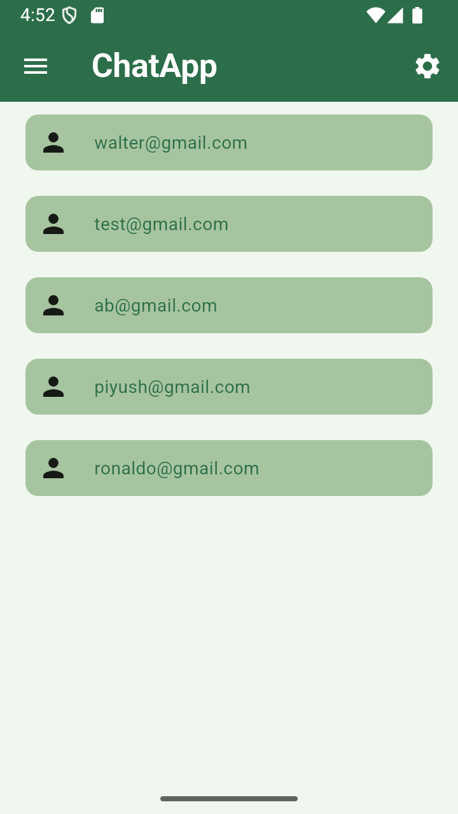

# 🚀 Flutter Chat App  
  
  
  
  

📱 A **real-time chat app** built with **Flutter & Firebase**, featuring **authentication, real-time messaging, and a beautiful UI**.  

---

## 📸 Screenshots  
| Login Page | Chat Screen | User List |
|------------|------------|------------|
|  |  |  |

---

## 🚀 Features  
✅ **Firebase Authentication** (Login, Signup, Logout)  
✅ **Real-time Chat** (Firestore Database)  
✅ **User Presence Detection** (Online/Offline Status)  
✅ **Dark Mode Support**  
✅ **Beautiful UI with Theming**  
✅ **Optimized Performance & Scrolling**  

---

## 🛠️ Tech Stack  
- **Flutter** (Dart) → UI Framework  
- **Firebase Firestore** → Database  
- **Firebase Authentication** → User Login  
- **Provider** → State Management  
- **Cloud Firestore** → Real-time Messaging  

---

## 📂 Folder Structure  
```
lib/
│-- components/      # UI Components (Chat Bubbles, TextFields, etc.)
│-- moduls/          # Chat & Authentication Logic
│-- pages/           # App Screens (Login, Chat, Home)
│-- services/        # Firebase & API Services
│-- themes/          # Light & Dark Mode Themes
│-- main.dart        # App Entry Point
```

---

## 📦 Installation  
### 1️⃣ Clone the Repository  
```sh
git clone https://github.com/Piyush1716/firebase-chat-app.git
cd flutter-chat-app
```

### 2️⃣ Install Dependencies  
```sh
flutter pub get
```

### 3️⃣ Setup Firebase  
- Create a Firebase project at [Firebase Console](https://console.firebase.google.com/)  
- Enable **Authentication** (`Email/Password`)  
- Enable **Cloud Firestore**  
- Download `google-services.json` & place it in `android/app/`  
- Download `GoogleService-Info.plist` & place it in `ios/Runner/`  

### 4️⃣ Run the App  
```sh
flutter run
```

---

## 📌 To-Do  
- [ ] Add Push Notifications  
- [ ] Add Image/Media Sharing  
- [ ] Improve UI Animations  

---

## 🤝 Contributing  
PRs are welcome! Please **fork this repo** and submit a pull request.  

---

## 📜 License  
This project is **MIT Licensed**. Feel free to use and modify it.  

---

## 📬 Contact  
💬 **Want to connect?** Reach out to me on:  
📧 Email: **chunarapiyush10@gmail.com**  
📷 Instagram: [@itz__piyushh](https://www.instagram.com/itz__piyushh?igsh=MXdneHNldWF3OGg5ZA==)  

---

### ⭐ Don't forget to star the repo if you like it! 🌟  
